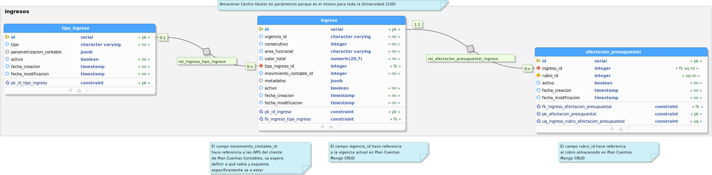

# Ingresos CRUD

API CRUD para la gestión de ingresos en el subsistema de Tesorería de Kronos.

## Estado CI

| Develop | Release 0.1.0 | Master |
| -- | -- | -- |
| [](https://hubci.portaloas.udistrital.edu.co/udistrital/ingresos_crud) | [](https://hubci.portaloas.udistrital.edu.co/udistrital/ingresos_crud) | [](https://hubci.portaloas.udistrital.edu.co/udistrital/ingresos_crud) |

## Especificaciones Técnicas

### Tecnologías Implementadas y Versiones

- [Golang](https://github.com/udistrital/introduccion_oas/blob/master/instalacion_de_herramientas/golang.md)
- [BeeGo](https://github.com/udistrital/introduccion_oas/blob/master/instalacion_de_herramientas/beego.md)
- [Docker](https://docs.docker.com/engine/install/ubuntu/)
- [Docker Compose](https://docs.docker.com/compose/)

### Variables de Entorno

Se proporciona el archivo [template.env](template.env) que relaciona las variables de entorno para ser remplazadas y cargadas fácilmente en el entorno.

**NOTA:** Las variables se pueden ver en el fichero conf/app.conf y están identificadas con `INGRESOS_CRUD_...`

<!-- ### Ejecución del Proyecto
```shell
#1. Obtener el repositorio con Go
git clone https://github.com/udistrital/evaluaciones_mongo_crud

#2. Moverse a la carpeta del repositorio
cd evaluaciones_mongo_crud

# 3. Moverse a la rama **develop**
git pull origin develop && git checkout develop

4. Instalar dependencias
npm install

# 5. Alimentar todas las variables de entorno que utiliza el proyecto.
EVALUACIONES_MONGO_CRUD=8080 EVALUACIONES_MONGO_CRUD=127.0.0.1:27017 EVALUACIONES_MONGO_CRUD_SOME_VARIABLE=some_value nest run -->
<!-- ``` -->
<!-- ### Ejecución Dockerfile
```shell
# docker build --tag=evaluaciones_mongo_crud . --no-cache
# docker run -p 80:80 evaluaciones_mongo_crud
``` -->

### Ejecución docker-compose

<!--
```bash
#1. Clonar el repositorio
git clone -b develop https://github.com/udistrital/ingresos_crud

#2. Moverse a la carpeta del repositorio
cd ingresos_crud

#3. Compilar imagen
docker-compose build

#5. Ejecutar el compose del contenedor
docker-compose up

#6. Comprobar que los contenedores estén en ejecución
docker ps
```
-->

### Ejecución Pruebas

Pruebas unitarias

```bash
# En Proceso
```

## Modelo de Datos

[Modelo de Datos](database/ingresos.svg)  



[Modelo PgModeler](database/ingresos.dbm)

## Licencia

This file is part of ingresos_crud.

ingresos_crud is free software: you can redistribute it and/or modify it under the terms of the GNU General Public License as published by the Free Software Foundation, either version 3 of the License, or (at your option) any later version.

ingresos_crud is distributed in the hope that it will be useful, but WITHOUT ANY WARRANTY; without even the implied warranty of MERCHANTABILITY or FITNESS FOR A PARTICULAR PURPOSE. See the GNU General Public License for more details.

You should have received a copy of the GNU General Public License along with ingresos_crud. If not, see https://www.gnu.org/licenses/.
